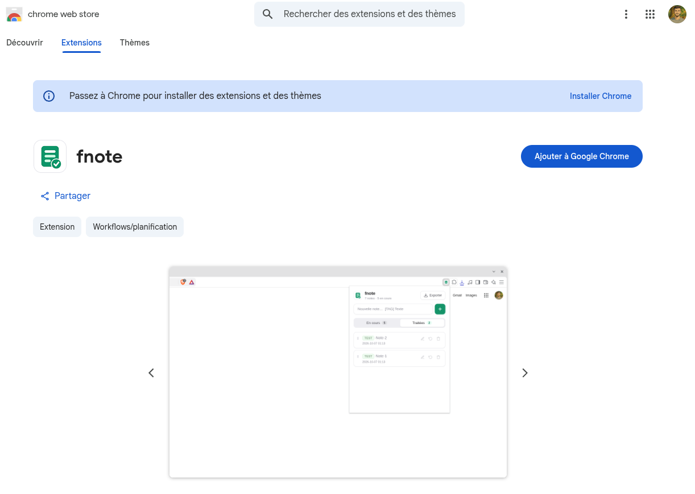

# 🧠 fnote – Extension de Brain Dump & Prise de Notes Rapides

> **Trop d'idées en tête ? Ne laissez plus la surcharge mentale freiner votre productivité. Videz votre esprit instantanément avec fnote.**

---

## 🚀 Qu'est-ce que fnote ?

**fnote** est une extension web ultra-légère, rapide et minimaliste conçue pour une tâche essentielle : **faire un "brain dump" immédiat**.

Lorsque vous naviguez sur le web, travaillez sur un projet, lisez un article ou enchaînez les réunions, les idées, tâches, rappels et informations s'accumulent très vite. Tenter de tout retenir crée une fatigue cognitive et nuit à votre concentration.

Avec **fnote**, vous n'avez plus besoin d'ouvrir une application lourde, de chercher un bloc-notes ou d'ouvrir un nouvel onglet : **un simple clic sur l'icône de l'extension suffit pour capturer votre pensée et libérer votre esprit.**

<p align="center">
  
</p>

## ✨ Fonctionnalités

* ⚡ **Prise de notes rapide** — capturez une idée sans quitter votre navigation.
* 🏷️ **Tags** — utilisez `[TAG] ma note` pour organiser vos notes.
* 🎨 **Tags colorés** — une couleur est automatiquement associée à chaque tag.
* ✏️ **Édition rapide** — modifiez vos notes directement depuis l'interface.
* ↕️ **Réorganisation** — déplacez librement vos notes et conservez leur ordre.
* 🔄 **États** — marquez vos notes comme *En cours* ou *Traitées*.
* 🔍 **Recherche & filtre par tags** *(v2.1)* — barre de recherche (insensible aux accents) et puces de tags cliquables, ou clic direct sur un tag dans une note.
* ☑️ **Sélection multiple de tags** *(v2.2)* — cochez plusieurs tags : les notes ayant au moins l'un d'eux s'affichent. Les tags proposés suivent la recherche et la section affichée (*En cours* / *Traitées*) ; les tags cochés filtrent les deux sections à la fois, et un tag non coché sans note dans la section affichée disparaît, et les tags les plus récents apparaissent en premier.
* ↩️ **Annuler** *(v2.1)* — retour en arrière après une suppression ou un import.
* 🌙 **Thème sombre automatique** *(v2.1)* — suit le réglage de votre système.
* ⚙️ **Menu Paramètres** *(v2.1)* — accessible via l'engrenage en haut à droite.
* 💾 **Export JSONL** — exportez vos données au format `dump.jsonl`.
* 📥 **Import JSONL** *(v2.1)* — importez un `dump.jsonl` : *Fusionner* (ajoute uniquement les nouvelles notes) ou *Remplacer tout*.
* 🔒 **Stockage local** — vos notes restent stockées localement dans le navigateur.

## 👜 Installation

### 🌐 Chrome Web Store

[Installer fnote depuis le Chrome Web Store](https://chromewebstore.google.com/detail/fnote/gpfldnlnnhdgooeccheppmjendompial)

<p align="center">
  <a href="https://chromewebstore.google.com/detail/fnote/gpfldnlnnhdgooeccheppmjendompial">
    
  </a>
</p>

### 🛠️ Installation manuelle

1. Téléchargez et décompressez `fnote-web-extension.zip`.
2. Ouvrez `chrome://extensions/`.
3. Activez le **Mode développeur**.
4. Cliquez sur **Charger l'extension non empaquetée**.
5. Sélectionnez le dossier contenant `manifest.json`.

Compatible avec les navigateurs basés sur Chromium : **Chrome, Brave, Edge, Vivaldi, etc.**

## 🚀 Utilisation

1. Cliquez sur l'icône **fnote** dans la barre d'extensions.
2. Saisissez votre note.
3. Ajoutez éventuellement un tag, par exemple :

```text
[DSI] Faire les VLAN du site de Paris
```

4. La note est enregistrée automatiquement.

Les notes peuvent ensuite être modifiées, réorganisées ou marquées comme traitées.

## 🔒 Données & confidentialité

fnote fonctionne en **local-first**.

* Les notes sont stockées localement dans le navigateur.
* Aucune synchronisation avec un serveur distant n'est nécessaire.
* Aucun compte n'est requis.
* Les données peuvent être exportées et réimportées via `dump.jsonl` (menu ⚙️ Paramètres).

Le format JSONL permet de conserver une séparation simple entre l'interface et les données.

## 🛠️ Open Source

fnote est un projet open source.

* 📦 Extension : ce dépôt
* 💻 CLI : disponible dans le projet
* 🐛 Bugs & suggestions : [GitHub Issues](https://github.com/medaey/fnote/issues)

## 📄 Licence

MIT — voir [`LICENSE`](LICENSE).
