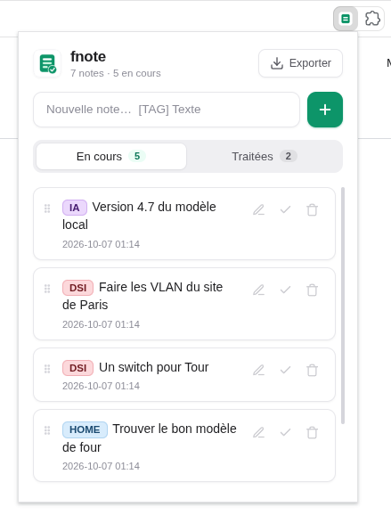

# fnote - Extension Web

Extension Chrome / Edge / Brave avec une Interface graphique moderne, minimaliste et en thème clair pour la gestion de notes.

  

---

## 🚀 Fonctionnalités

- **Ajout rapide** de notes avec catégorisation via tags (`[PROJECT] ma note`).
- **Tags colorés automatiquement** : chaque `[TAG]` reçoit une couleur propre, toujours identique pour un même tag (insensible à la casse).
- **Édition directe en ligne** : cliquez sur une note ou sur l'icône de crayon pour la modifier instantanément.
- **Réorganisation libre** : attrapez la poignée ⋮⋮ à gauche d'une note et glissez-la où vous voulez (ou `↑` / `↓` au clavier sur la poignée). L'ordre est sauvegardé et conservé dans l'export `dump.jsonl`.
- **Gestion d'état** : basculez les notes entre *En cours* et *Traitées*.
- **Iconographie Feather SVG modernisée** : interface propre et harmonieuse.
- **Exportation `dump.jsonl`** : exportez vos notes en un clic pour une synchronisation transparente avec la CLI `fnote`.

## 📦 Installation

1. Téléchargez et dézippez le fichier `fnote-web-extension.zip`.
2. Ouvrez votre navigateur (Chrome, Brave, Edge).
3. Allez sur `chrome://extensions/` et activez le **Mode développeur** (en haut à droite).
4. Cliquez sur **Charger l'extension non empaquetée** (*Load unpacked*).
5. Sélectionnez le dossier dézipé contennant le `manifest.json`.

## 📄 Licence

Licence MIT. Voir [LICENSE](LICENSE) pour plus d'informations.