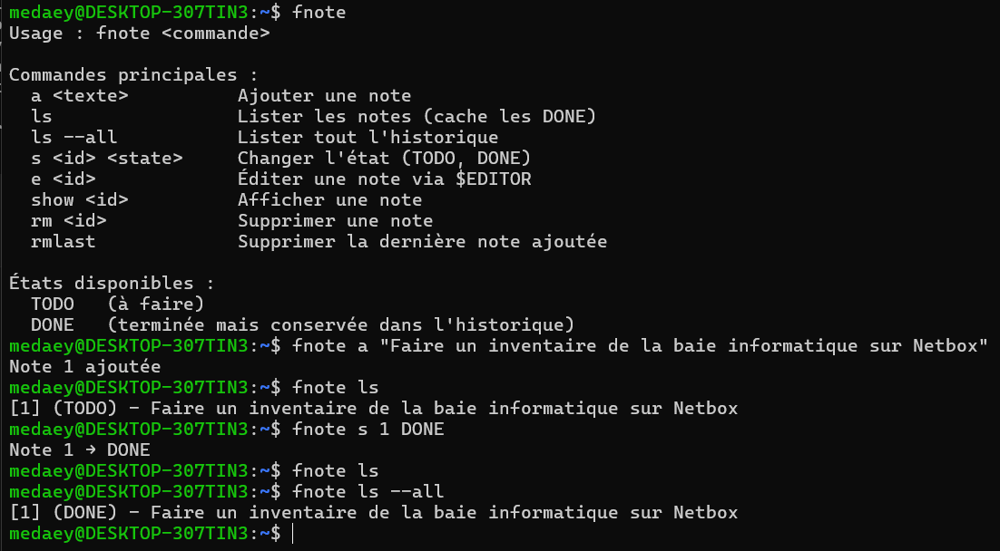

# fnote

[](https://github.com/medaey/fnote) 
[](https://www.gnu.org/software/bash/) 
[](https://www.json.org/)

**fnote** est un gestionnaire de notes minimaliste pour le terminal, conçu pour capturer rapidement des idées et informations, tout en préservant votre flow de travail. Chaque note possède un **ID unique**, un **état**, une **date de création**, et peut contenir des **détails annexes**.



---

## 🗂️ Structure du projet

```

fnote/
├── fnote.sh          # Script principal
├── assets/           # Dossier pour captures ou images
│   └── fnote_screen.png
└── README.md         # Documentation du projet

````

---

## ⚡ Fonctionnalités principales

| Fonctionnalité | Exemple d’utilisation |
|----------------|---------------------|
| 🆔 ID auto-incrémenté et date automatique | `fnote add "Nouvelle note"` |
| ✏️ Ajouter des détails annexes | `fnote att 1 "Installer logiciel XYZ"` |
| 📋 Lister les notes | `fnote list` |
| 🔍 Afficher une note complète | `fnote show 1` |
| ✅ Marquer une note comme TERMINE / revenir en TODO | `fnote done 1` ou `fnote nodone 1` |
| 🗑️ Supprimer une note ou la dernière ajoutée | `fnote delete 1` ou `fnote remove` |
| 💾 Stockage simple en JSON | Toutes les notes sont stockées dans `/var/lib/fnote/fnote.json` |
| 🎯 Minimaliste et rapide | Tout fonctionne directement depuis le terminal |

---

## 🚀 Installation

```bash
# 1️⃣ Cloner le dépôt
git clone https://github.com/medaey/fnote.git
cd fnote
chmod +x fnote.sh

# 2️⃣ Créer le dossier de stockage global
sudo mkdir -p /var/lib/fnote
sudo chown "$USER":"$USER" /var/lib/fnote

# 3️⃣ Copier le script dans ~/bin pour l'utiliser comme commande globale
mkdir -p ~/bin
cp fnote.sh ~/bin/fnote
chmod +x ~/bin/fnote

# 4️⃣ S'assurer que ~/bin est dans le PATH (ajouter dans ~/.bashrc si nécessaire)
echo 'export PATH=$HOME/bin:$PATH' >> ~/.bashrc
source ~/.bashrc

# ✅ Vous pouvez maintenant utiliser fnote depuis n'importe où :
# fnote add "Nouvelle note"
# fnote att 1 "Détail"
# fnote list
# fnote show 1
````

---

## 🛠️ Commandes principales

| Commande               | Alias | Description                                      |
| ---------------------- | ----- | ------------------------------------------------ |
| `add "titre"`          | —     | Créer une nouvelle note avec titre               |
| `attach <id> "détail"` | `att` | Ajouter un détail à une note existante           |
| `show [id]`            | —     | Afficher toutes les notes ou une note spécifique |
| `list`                 | —     | Lister toutes les notes (titre + état)           |
| `done <id>`            | —     | Marquer une note comme terminée                  |
| `nodone <id>`          | —     | Remettre une note en TODO                        |
| `delete <id>`          | `del` | Supprimer une note                               |
| `remove`               | `rm`  | Supprimer la dernière note ajoutée               |

---

## 💾 Stockage

* Toutes les notes sont stockées dans **`/var/lib/fnote/fnote.json`**
* Format simple et lisible
* Facile à éditer manuellement si nécessaire

---

## 🎯 Pourquoi fnote ?

* Capture rapide des idées avec **ID unique**
* Organisation simple et efficace, sans distractions
* Gestion des **détails annexes** pour chaque note
* Parfait pour **préserver le flow** et ne rien oublier

---

## 🔧 Personnalisation

* Modifier les **emojis** pour les états DONE/TO DO dans `show_note()`
* Adapter la mise en page des détails ou le style d’affichage selon vos préférences

---

## 📌 Exemple d’utilisation

### Créer une note

```bash
$ fnote add "Refaire salle informatique"
Note 1 créée le 2025-11-14T21:20
```

**Résultat :**

```
[1] Refaire salle informatique - 🔄 - 2025-11-14T21:20
```

### Ajouter des détails

```bash
$ fnote att 1 "Installer logiciel XYZ"
$ fnote att 1 "Vérifier licence XXXXX-XXXX-XXX"
```

**Résultat :**

```
[1] Refaire salle informatique - 🔄 - 2025-11-14T21:20
    ✏️ Installer logiciel XYZ
    ✏️ Vérifier licence XXXXX-XXXX-XXX
```

### Lister toutes les notes

```bash
$ fnote list
[1] Refaire salle informatique - TODO
[2] Acheter nouveau câble réseau - EN COURS
```

### Marquer comme terminé

```bash
$ fnote done 1
Note 1 marquée comme TERMINE
```

### Revenir en TODO

```bash
$ fnote nodone 1
Note 1 remise en TODO
```

### Supprimer une note

```bash
$ fnote delete 2
Note 2 supprimée
```

### Supprimer la dernière note

```bash
$ fnote remove
Dernière note supprimée
```

---

> fnote – Minimaliste, rapide et pratique pour le terminal
